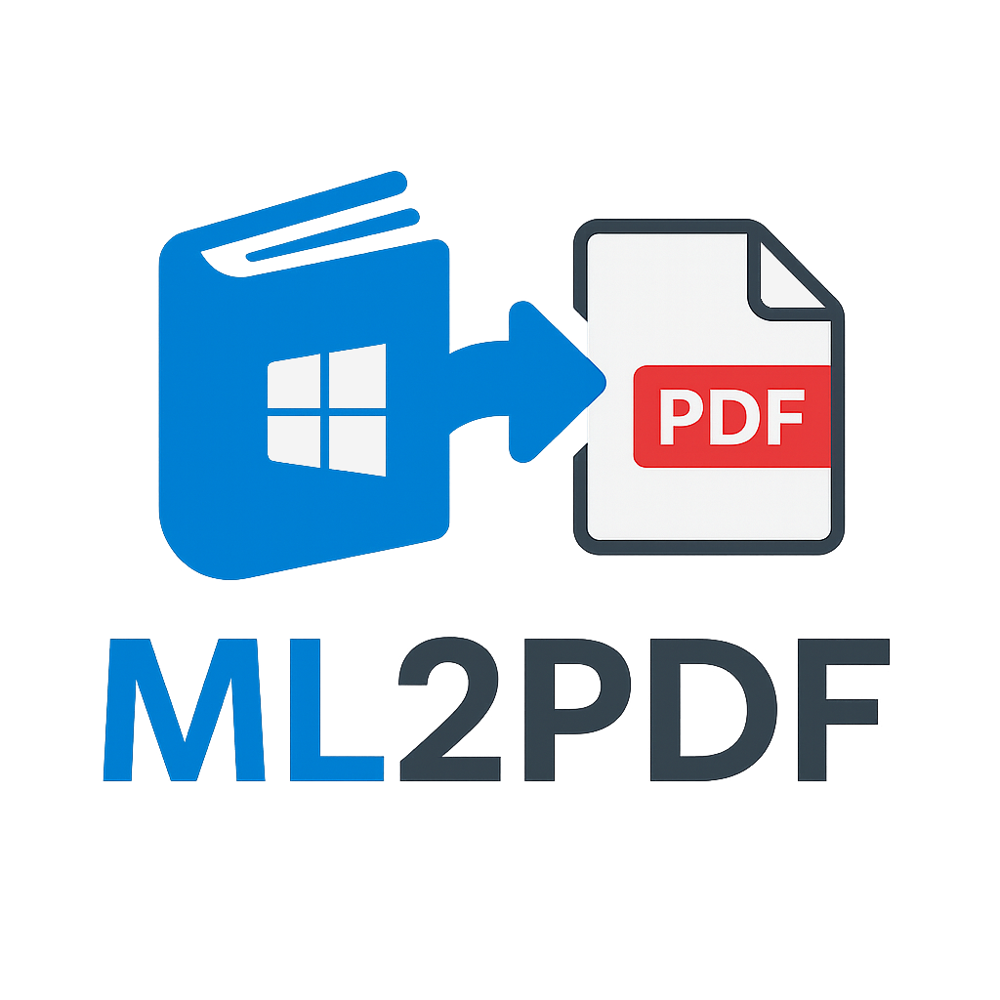

ML2PDF
======
<p align="center">
  
</p>

This project converts Microsoft Learn courses into PDF files by downloading and processing course and module content.


Features
--------

* Convert Microsoft Learn courses to PDF format.
* Download HTML content of modules and units.
* Process and convert HTML content into PDF files.
* Merge unit PDF files into a single PDF file of the entire course.

Usage
-----

Windows users can download the compiled version from the [Releases](https://github.com/tu_usuario/learn-microsoft-courses-to-pdf/releases) section and run the program with the following command:

```sh
ml2pdf.exe url_of_the_course
```

For example:
```
ml2pdf.exe "https://learn.microsoft.com/en-us/training/courses/azure-administrator"
```

Requirements
-----
* Rust and Cargo: Rust installation.
* wkhtmltopdf: Tool to convert HTML to PDF.
* pdfunite: Tool to merge PDF files.

Compilation
-----
1. Clone the repository:
```
git clone https://github.com/edgarburgues/ml2pdf.git
cd ml2pdf
```
2. Install dependencies:
```
cargo build
```

Notes
-----
* Make sure you have a stable Internet connection while running the program.
* Temporary files generated during the process are automatically deleted after the PDFs are merged.
* If an error occurs during the process, the temporary files will not be deleted automatically, and you may have to delete them manually.

License
-----
This project is licensed under the MIT License. See the LICENSE file for details.